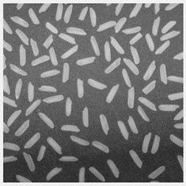

# 问题描述
>圆桌收录
科普看世界

给出一袋米，要求在尽量不逐一数的情况下，运用最为简便且高效的方法，如何确定这一袋米里面的米粒数量是偶数还是奇数？

我对数学不太了解，但也比较感兴趣。这个问题其实是我偶然想到的，我知道可能找不到准确的答案，但我想通过这个问题，获得数学、统计学，甚至哲学大佬的一些启发。这个问题能不能解决已经不重要了，有一些理论上可行的思路，才是最可贵的。

本问题希望探讨一些关于数论或是自动化工程方面的知识，并不希望得到诸如将一粒米分两半或是偷偷销毁一类米之类的抖机灵回答。

还请各领域大佬指教！




# 简单的解法
#### 数学上
我们假设有一种算法能够对每一粒米精确划分，准确率为99.999%
假设一袋米有n粒，且$\hat{n}\sim \operatorname{Binomial}(n,p)$
根据Binomial的定义:$p_k=\left(\begin{matrix}n\\k\end{matrix}\right)p^k(1-p)^{n-k}$
预测完全正确的概率为：$p(n)=p^n$
我们可以统计出来:
| n(一袋米的数量)               | 结果                            |
|--------------------------|---------------------------------|
| 10000            | 0.9048369656147593              |
| 30000            | 0.7408171094488235              |
| 50000            | 0.6065291433791509              |
| 60000            | 0.5488099896521101              |
| __69314__            | __0.5000018574234475__              |
| __69315__            | __0.4999968574048733__              |
| 70000            | 0.4965835657358828              |
| 300000           | 0.049786321563140515            |

也就是说，只要你的一袋米的数量大于7万左右，你完全可以实现直接蒙奇偶来计算正确结果。
#### 工业上

请参考美亚光电的官网介绍。

#### 项目架构
```
test
```
# 参考文献
[如何使用传统图像处理方法进行大米的计数和长轴方向标记](https://zhuanlan.zhihu.com/p/426764367)
[校正亮度不均匀问题并分析前景对象](https://ww2.mathworks.cn/help/images/correcting-nonuniform-illumination.html)
[基于形态学的目标检测——统计大米数量](https://blog.csdn.net/weixin_50731917/article/details/128463253)